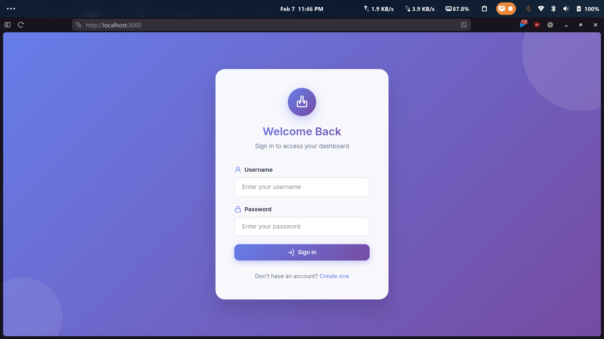
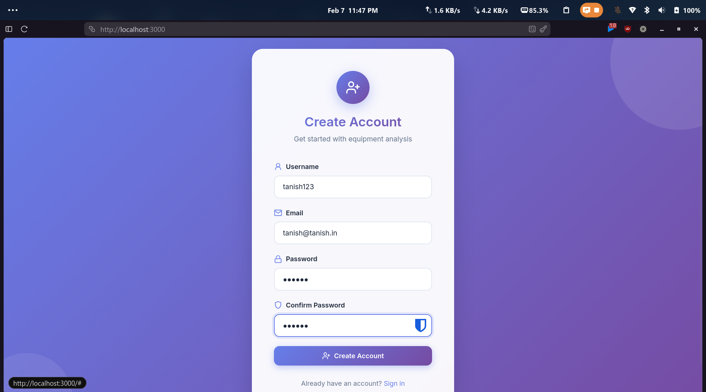
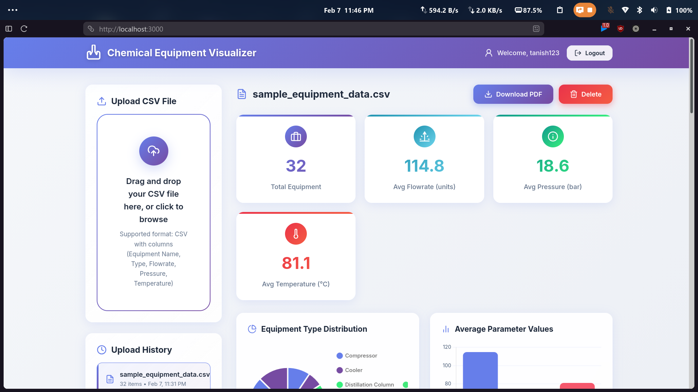
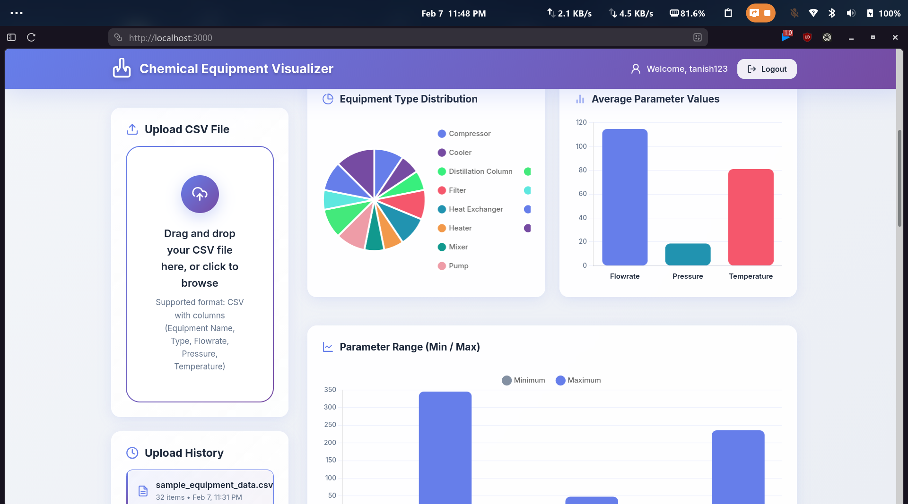
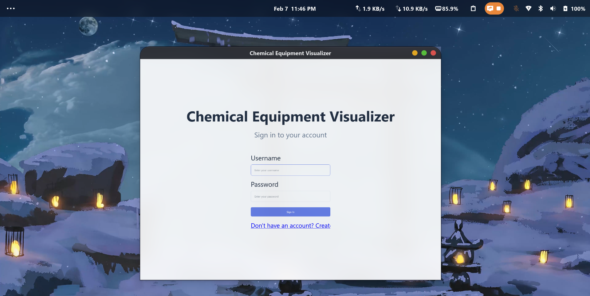
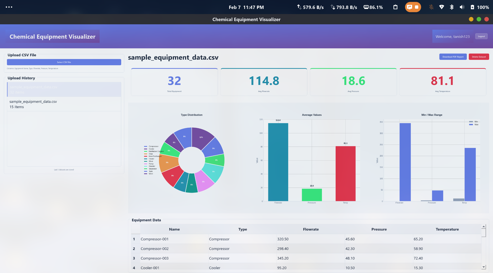

# Chemical Equipment Parameter Visualizer

A hybrid **Web + Desktop** application for uploading, analyzing, and visualizing chemical equipment data from CSV files.

## Features

- **CSV Upload**: Upload equipment data with drag-and-drop (Web) or file dialog (Desktop)
- **Data Analysis**: Automatic calculation of averages, min/max values, and type distribution
- **Interactive Charts**: Visualize data with pie charts, bar charts, and comparison charts
- **PDF Reports**: Generate downloadable PDF reports with complete analysis
- **History Management**: Stores last 5 uploaded datasets per user
- **Authentication**: Secure user registration and login

## Tech Stack

| Layer | Technology |
|-------|------------|
| Backend | Django + Django REST Framework |
| Web Frontend | React.js + Vite + Chart.js |
| Desktop Frontend | PyQt5 + Matplotlib |
| Database | SQLite |
| Data Processing | Pandas |

## Project Structure

```
chemical-equipment-visualizer/
├── backend/                 # Django REST API
│   ├── config/             # Django settings
│   ├── equipment/          # Main app (models, views, serializers)
│   └── requirements.txt
├── web-frontend/           # React application
│   ├── src/
│   │   ├── components/    # React components
│   │   └── services/      # API client
│   └── package.json
├── desktop-frontend/       # PyQt5 application
│   ├── main.py            # Entry point
│   ├── widgets.py         # UI components
│   └── api_client.py      # API client
├── sample_equipment_data.csv
└── README.md
```

## Setup Instructions

### Prerequisites

- Python 3.9+
- Node.js 18+
- pip
- npm

### 1. Backend Setup

```bash
# Navigate to backend directory
cd backend

# Create virtual environment (optional but recommended)
python -m venv venv
source venv/bin/activate  # Linux/Mac
# or: venv\Scripts\activate  # Windows

# Install dependencies
pip install -r requirements.txt

# Run migrations
python manage.py migrate

# Create superuser (optional, for admin access)
python manage.py createsuperuser

# Start the server
python manage.py runserver
```

The API will be available at `http://127.0.0.1:8000/api/`

### 2. Web Frontend Setup

```bash
# Navigate to web frontend directory
cd web-frontend

# Install dependencies
npm install

# Start development server
npm run dev
```

The web app will be available at `http://localhost:3000`

### 3. Desktop Frontend Setup

```bash
# Navigate to desktop frontend directory
cd desktop-frontend

# Install dependencies
pip install -r requirements.txt

# Run the application
python main.py
```

## API Endpoints

| Endpoint | Method | Description |
|----------|--------|-------------|
| `/api/auth/register/` | POST | User registration |
| `/api/auth/login/` | POST | User login |
| `/api/upload/` | POST | Upload CSV file |
| `/api/datasets/` | GET | List datasets (last 5) |
| `/api/datasets/{id}/` | GET/DELETE | Get or delete dataset |
| `/api/datasets/{id}/summary/` | GET | Get summary statistics |
| `/api/datasets/{id}/report/` | GET | Download PDF report |

## CSV Format

The CSV file must include these columns:

```csv
Equipment Name,Type,Flowrate,Pressure,Temperature
Pump-001,Pump,150.5,25.3,45.2
Reactor-001,Reactor,0,15.8,180.5
```

A sample file (`sample_equipment_data.csv`) is included for testing.

## Running Tests

```bash
cd backend
python manage.py test equipment.tests
```

## Screenshots

### Web Application









### Desktop Application







##  Contact

**Developer**: Tanish Kumar Kar
**Email**: tanishbiswas09@gmail.com

---

**Thank you for reviewing this submission!**
